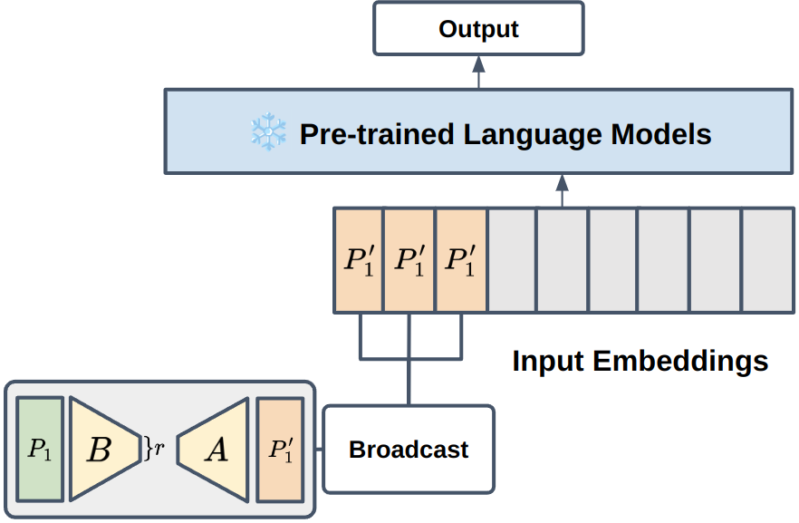

<!-- omit in toc -->
# Scaled Prompt Tuning

This repository contains **S**caled **P**rompt **T**uning (SPT).



**Table of contents**

- [Setup](#setup)
  - [Installation](#installation)
  - [Data](#data)
    - [Baselines](#baselines)
  - [Training](#training)
    - [Few-shot Learning](#few-shot-learning)

## SPT

We introduce **S**caled **P**rompt **T**uning - **scaling** a soft prompt using a very shallow network without activation and normalization layers and **broadcasting** the soft prompt.

# Setup

## Installation

Clone this repository as follows:

```bash
git clone https://github.com/whdnjsdyd111/spt
cd spt
```

We conduct our experiment with Anaconda3.

```bash
conda create -n spt python=3.8
conda activate spt
```

Secondly, Install pytorch.

```bash
pip install torch==2.0.0 torchvision==0.15.1 torchaudio==2.0.1
```

Finally, install our package environment.

```bash
pip install -r requirements.txt
```

SPT is implemented based on Huggingface PEFT (https://github.com/huggingface/peft)

## Data

We download and preprocess SuperGLUE, GLUE, MRQA, and "Other" datasets from the Huggingface Datasets APIs in our codes.

### Baselines

- the scripts for fully fine-tuning is located in `run_script/full-fine-tuning/*`
- the scripts for each prompt-based method are located in `run_script/peft/*`

## Training

You can easily train all tasks and methods by running the script.

The scripts for each method consists of a directory as follows

- **SuperGLUE**: `run_superglue-t5.sh`  
- **GLUE**: `run_glue-t5.sh`  
- **MRQA**: `run_qa-t5.sh`  
- **Others**: `run_others-t5.sh`  

### Few-shot Learning

Set the `k_shot_example` parameter to specify the number of examples to be used for k-shot learning.

```bash
python run.py \
  ...
  --num_virtual_tokens $virtual_token \
  --k_shot_example 16;
```

